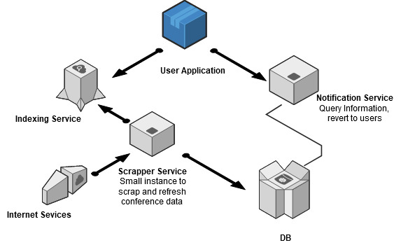

# CONTRIBUTING

Thank you for considering to contribute to this project. I came up with the idea personally when I felt that I needed some personalised single source solution of recuring reminder and manager for scientific conferences. So came the idea of conference-notify. In order to contribute do go through the architecture section and then to some basic coding stadards , issue tracking and PR standards.

# Understanding the Architecture of the Services

Irrespective of the deployment strategy the core acrhitecture shall remain this way.

<centre>
</img>
</centre>

The project is built in a microservice fashion with each service exposing some sort of rest api for delivering the information except Scrapper-Service. The scrapper service currently needs to be run as an independent process. The services mostly rely on a common MongoDb and a Elastic Search service for information retrieval and storage.   

The services themselves are written in Python and JavaScript primarily.

### Scrappper-Service

Move to [Scrapper-Service](https://github.com/rajatkb/Conference-Notify/tree/master/Scrapper-Service)

### Notifier-Service

Not yet updated keep tabs on issue and project board

### Search-Service

Not yet updated keep tabs on issue and project board

### User-Application

Not yet updated keep tabs on issue and project board

### ATTENTION

When contributing to this repository, please first discuss the change you wish to make via issue, email, or any other method with the owners of this repository before making a change.

Please note we have a code of conduct, please follow it in all your interactions with the project.
Pull Request Process

 
    1.  Create your own branch with convention "name_of_the_task@yourfirstname"

            git checkout -b <you_branch_name>

        Do changes and commit on that branch using:

            git add <list_of_files_to_be_committed> or git add .
            git commit -a -m "commit_message"
            git push origin <your_branch_name>
         
        Once committed the changes and pushed, create a pull request with that branch. Please make sure to add #issue_number in the description of the PR along with the list of features added.
    
    2.  Do verify that your branch have got all the changes that are done in the         main repo.Before a branch push or PR, do a pull from remote master to get        recent changes by following steps:

            git remote add upstream https://github.com/rajatkb/Conference-Notify.git
            git remote -v
            git fetch upstream
            git checkout master
            git merge upstream/master
            git push origin master

    3.  Once the PR is submitted the branch will be verified
        and merged to master by mentors.

    4.  Update the README.md if needed, accordingly. 
        Every change must be mentioned if readme requires change.

    [Under GSSOC]
    5.  Make sure to label your PR with beginner,
        easy, medium, hard. According to the issue it is targetting. 

    

