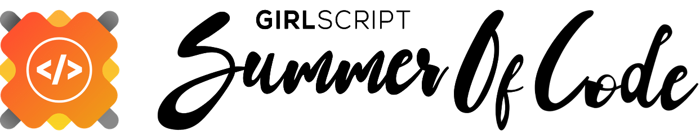

# Conference-Notify

## [](https://github.com/dwyl/esta/issues)

Conference-Notify will be an open source web based application that will aggregate conference information from wikicfp , guide2research and other such websites to create a single point of aggregated information and build index over the same. These information can then be searched by users through plain text queries. On finding relevant conferences the user can create recurring notifiers for themselves for the date reminders which can be enabled on both mobile devices and through browser notification.

## Getting Started

These instructions will get you a copy of the project up and running on your local machine for development and testing purposes. See deployment for notes on how to deploy the project on a live system.

### Prerequisites

* Mongodb installation (Local / Atlas)
* Python 3.6+ environment
* [Pymongo client](https://www.mongodb.com/blog/post/getting-started-with-python-and-mongodb)  
* node.js
* Angular 6+

Pymongo client installation
```shell
python -m pip install pymongo

```

### Installing

The projected is devided into several components, i.e services

* Notifier-Service
* Scrapper-Service
* Search-Service

None of this services requires any instllation and can be executed on the fly

**Other services coming soon**


## Deployment

**Scrapper-Service**  
Note: Make sure the configuration file is properly configured for usage, since main.py is reading configuration from the file

```
>> cd Scrapper-Service

>> python main.py --help
usage: main.py [-h] [-c CONFIG] [-l {debug,warn,error,info}] [-t TEST]
               [-ls {console,file}]

optional arguments:
  -h, --help            show this help message and exit
  -c CONFIG, --config CONFIG
                        Specify config.json file ,default: config.json
  -l {debug,warn,error,info}, --log {debug,warn,error,info}
                        Specify the debug level ,default: debug
  -t TEST, --test TEST  Specify whether to test app initialization or run the
                        scrappers ,default: True
  -ls {console,file}, --logStream {console,file}
                        Specify whether to print logs on terminal or to file
                        ,default: console

```

**Notifier-Service**

```shell

>> cd Notifier-Service

//For dev

>> npm run-script build

>> npm start 

//For prod

>> npm run-script build

>> npm run-script run

```


## Built With

* [pymongo](https://api.mongodb.com/python/current/) - Mongo client for python


## Contributing

Please read [CONTRIBUTING.md](https://github.com/rajatkb/Conference-Notify/blob/master/CONTRIBUTING.md) for details on our code of conduct, and the process for submitting pull requests to us.

## Authors

* **Rajat Kanti Bhattacharjee** - *Initial work* - [rajatkb](https://github.com/rajatkb)

#### Contributors  

Waiting for some 🧐

## License

This project is licensed under the GPL License - see the [LICENSE.md](LICENSE.md) file for details

## Acknowledgement


<centre>
</img>
</centre>


A big thanks to GirlScript foundation for having this project under [GirlScript Summer of Code](https://www.gssoc.tech/)